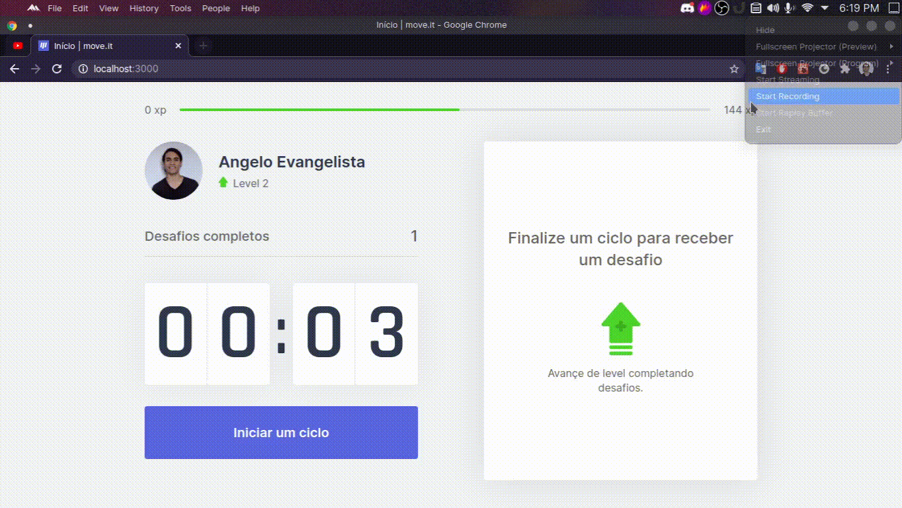

<h1 align="center">


</h1>

<h3 align="center">
  Move it
</h3>
<p>

<p align="center">Hey, há quanto tempo você está nessa tela, hein? Mova-se!</p>

# Requisitos

- Ter instalada o [NodeJs](https://nodejs.org/en/).
- Ter instalada a CLI do [GIT](https://git-scm.com/downloads) (apenas para clonar o projeto).

# Como executar o projeto

Em uma janela do terminal, clone este repositório em alguma pasta do seu computador, na `desktop`, por exemplo, através do comando `git clone`:

```bash
git clone https://github.com/angeloevangelista/move-it.git ./move-it
```

Abra a pasta e execute o comando `npm install`, ou `yarn` se preferir, para baixar as dependências:

```bash
cd ./move-it

npm install
# ou yarn
```

Pronto, basta executar o script `dev` e um servidor local será criado na porta 3000:

```bash
npm run dev
# ou yarn dev
```

# Dê uma olhada agora


